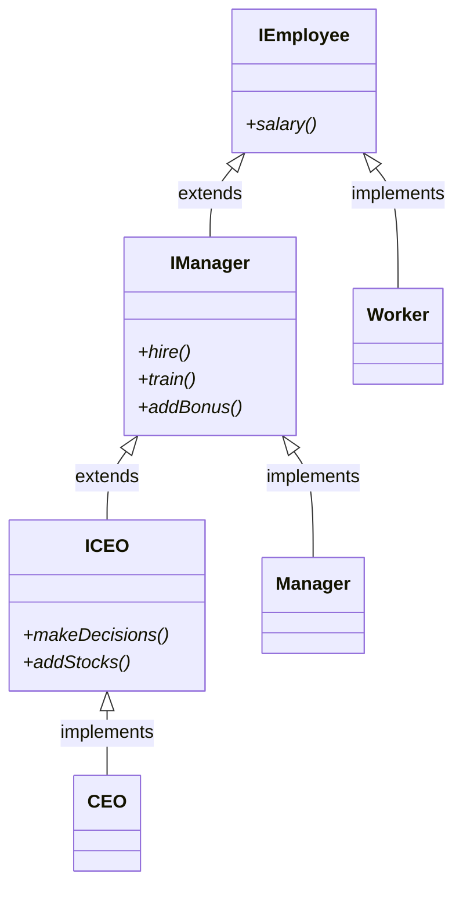

# Interface Segregation Principle

In the previous lectures we have considered the Interface Segregation Principle. We've seen how to eliminate fat interfaces with multiple interfaces.

Let's solve the following problem - we have a fat interface like this:

```java
    public interface Employee {
    	// CEO + managers + workers
    	public void salary();
    	// managers
    	public void hire();
    	public void train();
    	// CEO + managers
    	public void addBonus();
    	// CEO
    	public void makeDecisions();	
    	public void addStocks();
    }
```

... and of course we have 3 classes - Worker, Manager and CEO. Let's split the fat interface into several interfaces and make sure the SOLID principle are not violated.

Good luck!

## Solution

The proposed solution in the course is as follows.

